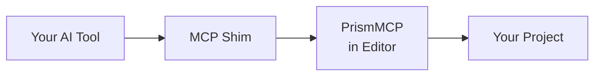

<!--
  PrismMCP marketing surface README.
  Source content authored in T1.33 brainstorm 2026-05-09.
  Spec of truth: github.com/Asara-Technologies/prism-mcp-source
                 docs/superpowers/specs/2026-05-09-t1-33-public-facing-github-presentation-design.md
-->

> [!IMPORTANT]
> **Coming Soon.** Pre-launch preview. Pricing, links, and copy may change before public launch. Feedback from testers and reviewers welcome.

<div align="center">

# Direct access to Unreal Engine.<br/>A professional force multiplier.

**Plumbing handled. Ship more game.**


[**Get on Fab**][fab] &nbsp;·&nbsp; [**Watch Demo**][demo]

[fab]: #
[demo]: #

</div>

---

## Engineers move faster. Everyone else stops waiting.<br/>*That's PrismMCP.*

Twenty years building games, from large studios to solo projects, from early
incubation to live ops. I know what we do day to day, and I built PrismMCP
with that in mind. How quickly we can understand a feature, debug an issue,
test, make a build, and get back to work matters as much as our ability to
make content. Maybe more. PrismMCP has both sides covered.

Engineer, designer, artist, producer. Whatever your role, PrismMCP bridges
the engineering gap that usually slows everyone else down.

I use PrismMCP personally and iterate on it daily, the same way we all
iterate on our games. If there's a workflow it doesn't cover, a bug, or a
plugin you need supported, let me know. I'll stand it up quickly, or get
back to you with a timeline. My whole career has been building
force-multiplying workflows. I'm truly excited to help with yours.

**Roger**, Asara Technologies

---

## How it works

Built on the [Model Context Protocol](https://modelcontextprotocol.io/). Your
AI tool connects to a running Unreal Editor through a small MCP shim. Commands
flow as typed JSON-RPC calls; the editor responds with structured results.



Works with **Claude Code**, **Cursor**, **Claude Desktop**, and any
MCP-compatible agent.

---

## 380+ commands across the entire UE editor

PrismMCP exposes the Unreal Editor to AI agents through the Model Context
Protocol. Author, edit, and ship from inside the editor.

| | Capability |
|:---|:---|
| **Blueprints** | End-to-end Blueprint authoring. Classes, members and overrides, components with parent/child hierarchy, interfaces, dispatchers, delegates. Full graph editing with 72 node types and transactional rollback. See sub-table below. |
| **Levels & World** | Populate levels, edit actors, manage sub-levels and level instances. First-class support for traditional worlds, World Partition worlds, and the World Partition editor (actor load, pin, DataLayer state). See sub-table below. |
| **Materials** | Author material graphs, build material instances, define material layers. |
| **UMG & UI** | Build widget Blueprints with bindings, animations, and editor utility widgets. |
| **Animation & Rigging** | Author AnimBP graphs, montages, Control Rigs, IK Rigs, IK Retargeters, plus skeleton and mesh inspection. |
| **Cinematics** | Author Level Sequences with tracks, keyframes, composition, playback, and MRQ rendering. |
| **Input & Gameplay** | Set up Enhanced Input, gameplay tags, and Game Feature plugins. |
| **Debug & Iterate** | Trigger Live Coding compiles, capture structured compile errors, read Output Log and Message Log, profile frame stats, run trace sessions. |
| **Build & Ship** | Cook, package, archive, deploy, and launch on devices. End to end. |
| **Source Control** | Provider status, write-readiness checks, and prepare-for-edit on Perforce or Git. |
| **Authoring Discovery** | Your AI introspects native C++ and Blueprint-generated types alike. Classes, functions, properties, structs, enums, asset registry, K2Node authoring discriminators. |
| **Editor Surface** | Console commands, CVars, selection state, PIE control, automation tests, undo and redo. |

### Levels & World in detail

| Surface | What it does |
|:---|:---|
| **Traditional levels** | Create maps, set current level, read level info, list and load streaming sub-levels, create and retarget Level Instance actors. |
| **World Partition** | First-class WP editor support. Load and unload actors, pin actors so the editor keeps them resident, dirty-actor protection on unload, deterministic refusal on monolithic worlds. |
| **DataLayers** | List DataLayer state, read and write actor memberships by asset path or instance name, set editor visibility, set runtime state (Unloaded / Loaded / Activated). |
| **Spawn & duplicate** | Spawn built-in actor types or Blueprint actors, duplicate placed actors with optional offset, replace actor class on existing placements, snap to grid or floor. |
| **Placed actor control** | Set transforms, tags, Outliner folder, label, hidden-in-editor and hidden-in-game flags, lock-or-unlock editing. Attach and detach actor roots and scene components. Add and remove instance components on placed actors. |
| **Instance variable editing** | Write Instance Editable Blueprint variables and any UPROPERTY on a placed actor via path-based writes. Bulk-edit multiple property paths in one call. Set component property paths on placed-actor components. Reset properties or component properties to CDO default. |
| **Outliner & selection** | World Outliner folder CRUD, get and set actor selection by handle, select by class or tag, batch multi-op transactions via `execute_batch`. |

### Blueprints in detail

| Surface | Coverage |
|:---|:---|
| **Class authoring** | Create Blueprint or Interface classes, set CDO defaults (physics, static mesh, pawn), read full class inheritance chain, compile with structured error and warning capture. |
| **Members and overrides** | Variables with full UPROPERTY flag and metadata control. Local function variables. Functions with params, return values, pure / const / access flags. Override parent functions (BlueprintImplementableEvent, BlueprintNativeEvent, overridable). Modify signatures with affected-call-site reporting. |
| **Dispatchers, delegates, interfaces** | Event dispatchers with typed parameters. Delegate variables referencing dispatcher signatures. Interface implementations with auto-generated stub graphs and optional preservation on removal. |
| **Components** | Add and remove SCS components, reparent under scene components, reorder by sibling index, set relative transforms, set attachment and socket. Read full hierarchy across SCS, inherited SCS, and native components with editability metadata. |
| **Graph reading** | List graphs (event, function, macro, animation), read at four detail levels for token-cost control (`summary`, `standard`, `full`, `focus`), search by name, type, or content, single-node detail. |
| **Graph authoring** | 72 node types across 16+ categories: events, flow control, calls, casting, spawning, async and latent, collections, structs, delegates, operators, strings, math expressions, format text, plus a `custom` K2Node escape hatch. Inline wiring on `add_node`. Batch construction via `build_graph` with fail-fast and transactional rollback. |
| **Graph organization and hygiene** | Auto-layout via DAG algorithm. Insert reroute knots on existing wires. Comment lifecycle (add, modify, resize-to-fit, list contents). Find stale references (broken function, variable, cast, macro, struct). Reconstruct nodes after upstream signature changes. |

### Materials in detail

| Surface | Coverage |
|:---|:---|
| **Material asset** | Create `UMaterial` assets, read summary metadata (output bindings, expression count), request recompilation with status reporting, auto-layout expressions into a readable grid. |
| **Expression graph** | Read at three detail levels (`summary`, `standard`, `full`). Search expressions by type, caption, parameter name, property, or value. Single-expression detail by stable short ID or material expression GUID. |
| **Expression authoring** | Add expressions from registered discriminators (constants, scalar / vector / texture / static-switch parameters, texture sample / object / coordinate, math nodes, utility nodes, world nodes, custom expression) plus a `Custom` escape hatch for any `UMaterialExpression` class. Set reflected properties, connect outputs to expression inputs or to material attributes (BaseColor, Roughness, etc.). |
| **Parameters** | Add scalar, vector, texture, or static-switch parameter expressions. Update parameter name, group, sort priority, and scalar slider metadata. |
| **Material instances** | Create `UMaterialInstanceConstant` assets from a parent. Read full instance state (parent chain, all parameters, overrides, layer stack). Reparent with orphaned-override diagnostics. |
| **Parameter overrides** | Set and clear scalar, vector, and texture overrides. Walk inheritance chain for any parameter. Set static switches (triggers recompile) and list all static switches with current values. |
| **Material layers** | Assign layer functions and optional blends to layer slots. Read full layer stack with per-slot info. |

### Cinematics in detail

| Surface | Coverage |
|:---|:---|
| **Lifecycle and bindings** | Create `LevelSequence` assets, get metadata (display rate, playback range, tick resolution), open in the Sequencer editor. List bindings. Add and remove possessable actor bindings. Set binding display names. |
| **Tracks and sections** | Add typed tracks (transform, audio, event) to bindings or as master tracks. List tracks and sections. Set section frame ranges. Set section UPROPERTY values. Set event-section function endpoints. Organize tracks and bindings into folders. |
| **Keyframes** | List animation channels with type info. Get and set keyframe values. Set per-key interpolation (`linear`, `constant`, `cubic`, `auto`). Set tangent handles (arrive tangent, leave tangent, weight). Batch-add multiple keyframes in one call. Clear channels. |
| **Composition** | List subsequences. Walk composition hierarchy (depth-capped at 8). Add and remove subsequence references. Set subsequence frame ranges. Add camera-cut shots. Change shot camera bindings. |
| **Playback and rendering** | Get playback status. Play, pause, stop. Scrub the playhead by frame or seconds. List `MoviePipelinePrimaryConfig` render presets. Submit Movie Render Queue jobs. Check render job status. |

### Animation & Rigging in detail

| Surface | Coverage |
|:---|:---|
| **Animation Blueprints** | Author AnimGraphs through the Blueprint graph stack: sequence player, sequence evaluator, slot, layered bone blend, blend list (by bool, int, or enum), apply additive, mesh-space additive, dynamic additive, dead blending, inertialization, blend-bone-by-channel. State machine CRUD, transitions, entry-state wiring, and nested state machines via Blueprint graph commands. |
| **Animation Montages** | Create `UAnimMontage` assets from sequences. Section CRUD with next-section link management. Notify add and remove (instant or duration-state) by reflected class. Notify property edits. Float curve add and remove with key replacement. Blend in / out times and interpolation options (`Linear`, `Cubic`, `EaseIn`, `EaseOut`, `EaseInOut`). |
| **Skeleton and skeletal mesh** | Inspect `USkeleton` with bone hierarchy, sockets, animation curves, slot groups, registered notify names, virtual bones. Inspect `USkeletalMesh` with skeleton and physics references, material slots, morph targets, LOD vertex / triangle / section data. |
| **Control Rig** | Create Control Rig Blueprints with optional preview skeletal mesh and bone import. List and inspect RigUnit struct types. Read RigVM graphs (nodes, pins, links, local variables) and Control Rig hierarchies (bones, controls, nulls, curves). Add RigUnit nodes, asset variables, hierarchy elements (bone, control, null). Connect RigVM pins. Set pin defaults. Compile VM with structured warnings and errors. |
| **IK Rig** | Create IK Rig assets. Solver stack (`Limb`, `FullBodyIK`, `BodyMover`, `Pole`, `SetTransform`, `StretchLimb`): add, remove, set properties (`StartBone`, `EndBone`, `enabled`, nested settings). Goals: add for any bone, set goal properties, optional solver connection. Bone inclusion / exclusion. Retarget chains with optional IK goal association. Set retarget root bone. |
| **IK Retargeter** | IK Retargeter asset CRUD, rig binding, chain mapping, auto-map, pose edits. |

### UMG in detail

| Surface | Coverage |
|:---|:---|
| **Widget discovery** | List loaded `UWidget` subclasses with containment and slot metadata. Inspect a widget class for reflected properties, events, containment rules, and child slot schema. |
| **Widget tree authoring** | Build or replace a Widget Blueprint tree from a recursive JSON hierarchy with optional inline property bindings and event nodes. Add, get, modify, move (reparent, reorder, slot properties), and remove widgets with non-recursive child safety. |
| **Property bindings** | Bind widget properties to pure Blueprint functions using UMG's native editor binding table. Inspect all native property bindings, event bindings, and unbound bindable properties on a Blueprint. |
| **Event bindings** | Bind widget multicast delegates by creating or reusing native component-bound event nodes. Unbind cleanly. Works across any widget event surface. |
| **Widget animations** | Create animations with optional inline tracks. Add property-animation tracks with keyframes (auto-detected types: `float`, `FLinearColor`, `FWidgetTransform`). Modify (replace keyframes), remove, and list animations on a Widget Blueprint. |
| **Editor Utility Widgets and Blueprints** | Create EUW or EUB assets. Discover existing ones with type and path filters. Run zero-parameter `CallInEditor` functions on EUBs and capture logs. Spawn EUW as editor tabs (idempotent). Close tabs by ID or asset path. List currently open tabs. |

### Build & Ship in detail

| Surface | Coverage |
|:---|:---|
| **Build discovery** | Enumerate target platforms known to the engine install. List connected or known target devices (filterable by platform). List build targets and standard build configurations. Get project build metadata, default target, supported platforms, and RunUAT path. |
| **Build sessions** | Shared session manager for long-running builds. Get current or most recent session state with progress, current step, log tail, and result summary. Cancel active sessions. Get completed session artifacts (maps, log paths, package paths, launched devices). |
| **Map builds** | Run editor map-build passes (geometry, lighting, navigation, HLODs, texture streaming, virtual texture, landscape, or all) through the shared session manager. List supported build types and descriptions. |
| **Cook, package, archive** | Start RunUAT `BuildCookRun` sessions for cook, stage, package, and archive workflows. Suggested pipeline presets for common configurations. |
| **Deploy and launch** | Deploy staged packaged builds to target devices discovered through the platform device registry, optionally launching after deploy. Get live device connection and authorization state. |

> [!NOTE]
> **Full undo and redo on every write.** Every PrismMCP command participates in UE's transaction system. Hit Ctrl+Z to back out a change, or have your AI agent call `undo` and read `get_undo_history` programmatically to roll back cleanly. Inline graph-wiring failures roll back automatically before they corrupt the graph.

---

## Pricing

<div align="center">

| | **Personal** | **Indie** | **Pro** | **Enterprise** |
|:---|:---:|:---:|:---:|:---:|
| **Price** | $20 | $49 | **$199**/seat | Contact |
| Who | Hobbyists, learners | Solo & small commercial | Studios, pros | Studios needing source/SLA |
| Commercial use | No | Yes (rev < $50K/yr) | Yes | Yes |
| Projects | Personal/learning | Up to 2 | **Unlimited** | Negotiated |
| Activations | 1 machine | 2 machines | 4 per Seat | Negotiated |
| Updates | Latest at purchase | 12 mo + perpetual fallback | 12 mo + perpetual fallback | Negotiated |
| Support | Community | Public issues, fast iteration | Direct email, priority triage | Dedicated time, private channel |
| Source & tests | - | - | - | **Full source + the test suite I use to validate every release** |

**Bulk Pro:** 5+ seats $169/ea · 25+ seats $129/ea · 50+ contact

</div>

> [!NOTE]
> **Updates work like JetBrains.** Buy once, get 12 months of updates, then
> keep using whatever version you had, forever. Renew any time to start
> receiving updates again. Your license never expires.

<div align="center">

[**Get on Fab**][fab] &nbsp;·&nbsp; [**Buy direct**][direct] &nbsp;·&nbsp; [**Read the EULA**][eula]

[direct]: #
[eula]: #

</div>

### Pricing FAQ

<details>
<summary><strong>What happens if I stop renewing?</strong></summary>

Your license never expires. Even after your 12-month Updates Period ends,
you keep using whatever version of PrismMCP you had, forever. You just stop
receiving new updates and bug fixes. Renew any time to start receiving
updates again. (Same model JetBrains uses.)

</details>

<details>
<summary><strong>What's the refund policy?</strong></summary>

30-day no-questions-asked refund for Personal and Indie, counted from the
date you activate your license. Pro refunds are case-by-case. Enterprise
refunds are negotiated per contract. There's a hard cap of 60 days from
purchase to prevent indefinite delay.

</details>

<details>
<summary><strong>Can I move my license to a new machine?</strong></summary>

Yes. Each license has a fixed number of activations (Personal: 1, Indie: 2,
Pro: 4 per Seat). Deactivating one machine frees a slot for another. If you
hit a deactivation issue (lost laptop, dead drive), email me and I'll
release the activation manually.

</details>

<details>
<summary><strong>What counts as a "project"?</strong></summary>

A "project" is something you ship or distribute publicly using PrismMCP. A
real product, not an internal prototype. Experiments, learning projects,
and unreleased work don't count. Indie covers up to 2 shipped projects;
Pro is unlimited. We're reasonable about the gray zone. If you're
prototyping multiple ideas or transitioning between projects, you're not
violating anything until something actually ships.

</details>

<details>
<summary><strong>What if my revenue grows past $50K mid-year?</strong></summary>

Indie eligibility is based on your annual gross revenue at the time of
purchase or renewal. If you cross $50K during your Updates Period, keep
using your current license through the end of the period; at renewal,
upgrade to Pro. We don't audit. We trust you to call it honestly. I'm a
developer who needs to eat too, so when you graduate to Pro, that helps me
keep building.

</details>

<details>
<summary><strong>Do I need an internet connection to use PrismMCP?</strong></summary>

Only at activation and roughly once a week to verify your license. If you
go offline or the license server is unreachable, PrismMCP works for 10
days before requiring re-verification. Enough to cover a long weekend, a
flight, or a short trip without interruption. Long-term airgapped
deployments need an Enterprise arrangement.

</details>

<details>
<summary><strong>Are there discounts for students or schools?</strong></summary>

Personal covers individual students: $20, no commercial use, full plugin
functionality. Teachers, schools, or workshops needing something custom,
email me. I'm happy to make exceptions for people learning AI-assisted
Unreal workflows in school. I want to help, I just need to make sure I
can keep building too.

</details>

<sub>*These are plain-English summaries. Full legal terms in the [EULA][eula].*</sub>

---

## Get started

Up and running in under 5 minutes:

1. Install PrismMCP from [Fab][fab] (or download from the [drops repo][drops])
2. Activate your license key
3. Connect your MCP client
4. Issue your first command

**Compatibility:** UE 5.3 · 5.4 · 5.5 · 5.6 · 5.7 · Win / Mac / Linux

```json
{
  "mcpServers": {
    "unreal": {
      "command": "path/to/PrismMCP-Shim",
      "args": ["--port", "55557"]
    }
  }
}
```

API reference ships inside the plugin install. Setup guides and workflow recipes will be published in this repo at launch.

[drops]: #

---

## Support

| Tier | What you get |
|:---|:---|
| **Community** | Public GitHub Issues, public docs |
| **Indie** | Public issue tracker, fast iteration on workflow gaps |
| **Pro** | Priority issue triage, **direct email contact**, fast iteration |
| **Enterprise** | Dedicated time, private channel, custom feature work |

Public issues: [github.com/Asara-Technologies/prism-mcp/issues][issues]
Pro & Enterprise contact: [support@asaratechnologies.com][support]

[issues]: #
[support]: #

---

## About Asara

Asara is a California game-tools company, founded in 2026. We build
force-multiplying tools for game developers, starting with PrismMCP:
direct AI access to the Unreal Engine editor.

<sub>*Asara Technologies LLC.*</sub>

---

## Legal

- [End User License Agreement][eula]
- [Privacy Policy][privacy]
- [Refund Policy][refunds]

[privacy]: #
[refunds]: #

---

<div align="center">
<sub>

PrismMCP™ is a trademark of Asara Technologies LLC. Unreal Engine® is a
trademark of Epic Games, Inc.

© 2026 Asara Technologies LLC. All rights reserved.

</sub>
</div>
