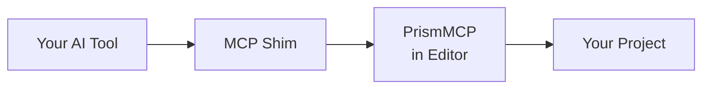

<!--
  PrismMCP marketing surface README.
  Source content authored in T1.33 brainstorm 2026-05-09 + amended 2026-05-10 post-bifurcation.
  Spec of truth: github.com/Asara-Technologies/prism-mcp-source
                 docs/superpowers/specs/2026-05-10-prismmcp-marketing-surfaces-design.md
-->

> [!IMPORTANT]
> **Coming Soon.** Pre-launch preview. Pricing, links, and copy may change before public launch. [EULA](EULA.md) and [Privacy Policy](PRIVACY.md) are published as pre-launch drafts; final legal text publishes at general availability. Feedback from testers and reviewers welcome.

<div align="center">

<sub><strong>ASARA PRISMMCP</strong></sub>

# Direct AI access to Unreal Engine.<br/>A professional force multiplier.

**Plumbing handled. Ship more game.**


[**Get Professional**][buy] &nbsp;·&nbsp; [Try on Fab][fab]

[**Documentation**](docs/) &nbsp;·&nbsp; [**Releases**](https://github.com/Asara-Technologies/prism-mcp/releases)

[buy]: #pricing
[fab]: #on-fab-one-time-purchase
[fab-product]: #on-fab-one-time-purchase
[direct-product]: #direct-from-asara-annual-license-no-auto-renewal

</div>

---

## Engineers move faster. Everyone else stops waiting.<br/>*That's PrismMCP.*

Twenty years building games, from large studios to solo projects, from early
incubation to live ops. I know what we do day to day, and I built PrismMCP
with that in mind. How quickly we can understand a feature, debug an issue,
test, make a build, and get back to work matters as much as our ability to
make content. Maybe more. PrismMCP has both sides covered.

Engineer, designer, artist, producer. Whatever your role, PrismMCP bridges
the engineering gap that usually slows everyone else down.

I use PrismMCP personally and iterate on it daily, the same way we all
iterate on our games. If there's a workflow it doesn't cover, a bug, or a
plugin you need supported, let me know. I'll stand it up quickly, or get
back to you with a timeline. My whole career has been building
force-multiplying workflows. I'm truly excited to help with yours.

**Roger**, Asara Technologies

---

## PrismMCP ships in two SKUs

**Lite: gameplay authoring.** Level actors, Blueprints (full authoring surface including graph editing and live debugging), components, reflected authoring, AI behavior authoring (Blackboard, Behavior Tree, EQS, StateTree), foliage type authoring, content browser, selection, console, programmatic scripting, custom tool extensions, PIE. The surface you live in day to day. [Sold on Fab][fab-product].

**Professional: the full editor.** Everything in Lite plus the production toolchain: Smart Objects, Materials, UMG/Common UI, Animation & Rigging, cross-system debugging, Blueprint-to-C++ preview, Cinematics, Build & Ship, Profiling, Automation tests, Data, Localization, World Partition, Source Control, native type reflection, editor lifecycle, Live Coding. [Sold direct from Asara][direct-product].

The SKU boundary is enforced in the build, not by a runtime toggle. Lite is
built from the Core + Lite modules only; Professional is built from the Core +
Lite + Pro modules from the same source SHA.

> [!NOTE]
> **Full undo and redo on every write.** Every PrismMCP command participates in UE's transaction system. Hit Ctrl+Z to back out a change, or have your AI agent call `undo` and read `get_undo_history` programmatically to roll back cleanly.

### Capability matrix

| Capability | Coverage | Lite | Professional |
|:---|:---|:---:|:---:|
| **Level actors** | Spawn, transform, delete; outliner; tags | ✓ | ✓ |
| **Blueprint scaffolding** | Class, variables, CDO defaults, function calls | ✓ | ✓ |
| **Blueprint graph editing** | Broad node coverage, transactional rollback | ✓ | ✓ |
| **Blueprint live debugging** | Breakpoints, stepping, watches, call stack snapshots | ✓ | ✓ |
| **Blueprint-to-C++ conversion preview** | Selected function/event migration, staged native files, guided workflow | — | ✓ |
| **Components / SCS** | Authoring on actors and Blueprints | ✓ | ✓ |
| **Reflected authoring** | List/read/validate/set/reset reflected properties; struct describe; array/set/map mutation | ✓ | ✓ |
| **AI behavior authoring** | Blackboard, Behavior Tree, EQS, StateTree: full authoring surface | ✓ | ✓ |
| **Foliage type authoring** | UFoliageType assets, source assignment, reflected property edits | ✓ | ✓ |
| **Selection state** | Get and set; by class or tag | ✓ | ✓ |
| **Content Browser** | Folders, asset organization, moves, import/reimport | ✓ | ✓ |
| **Console + CVars** | Read state, set CVars | ✓ | ✓ |
| **Programmatic scripting** | Sandboxed Python with `execute_tool()`, structured results, rollback on failure | ✓ | ✓ |
| **Custom tool extensions** | C++ modules, Blueprint Toolsets, UFUNCTION commands, Python extension packs | ✓ | ✓ |
| **PIE** | Start, stop, Play From Here | ✓ | ✓ |
| **Smart Objects** | Definitions, slots, behaviors, World Conditions, world placement | — | ✓ |
| **Cross-system debugging** | BT runtime, Control Rig/RigVM, StateTree trace | — | ✓ |
| **Materials** | Instances, graph editing, layers, parameter collections | — | ✓ |
| **UMG / Common UI** | Widget tree, bindings, animations, Editor Utility Widgets, CommonUI input tables and PIE stacks | — | ✓ |
| **Animation & Rigging** | AnimBP, montages, Control Rig, IK Rig, IK Retargeter, Physics Asset body/primitive/constraint authoring | — | ✓ |
| **Cinematics** | LevelSequence, keyframes, Curve Editor selection/visibility, MRQ rendering | — | ✓ |
| **Build & Ship** | Cook, package, archive, deploy, launch | — | ✓ |
| **Profiling** | Frame stats, Trace, Insights, GPU timing | — | ✓ |
| **Automation tests** | Discover, run async, poll progress and results | — | ✓ |
| **Enhanced Input + Game Features** | Input Actions, Mapping Contexts; plugin lifecycle | — | ✓ |
| **Gameplay Tags** | Hierarchy, project CRUD, matching, queries | — | ✓ |
| **Gameplay Ability System** | Attributes, effects, abilities, cues, ASC runtime, debug | — | ✓ |
| **Data** | DataTables, DataAssets, Type System | — | ✓ |
| **Localization** | Targets, cultures, GatherText pipeline, String Tables | — | ✓ |
| **World Partition** | OFPA, DataLayers, streaming, level composition | — | ✓ |
| **Source Control** | Provider status, read commands, write commands | — | ✓ |
| **Native type reflection** | K2Node discriminators; Asset Registry queries | — | ✓ |
| **Editor lifecycle** | save_all, shutdown, project metadata | — | ✓ |
| **Live Coding** | Compile trigger, structured error capture | — | ✓ |

Full capability breakdown by module: [docs/capabilities/](docs/capabilities/)

---

## On the roadmap

The matrix above is today's shipped surface. Here's what's planned next. Order, scope, and timing are not committed; items move based on customer demand, engine changes, and effort.

**Authoring expansions**

- **Smart Objects follow-ups.** Parameters and bindings, persistent collections, runtime integrations, and StateTree interaction hooks.
- **Niagara.** System and emitter lifecycle, parameter access, limited graph mutation.
- **Audio.** Sound Cue graph, SoundClass/SoundMix, MetaSound asset and graph.

**Workflow expansions**

- **Editor tab and dock layout.** Sense and manipulate layout; save and restore named workspaces.
- **Source Control expansion.** Submit, branch, sync, merge orchestration on top of today's read and checkout surface.
- **Cross-platform builds.** Mac and Linux build axis.

<sub>*Professional gets the full roadmap. Lite also receives gameplay-authoring core expansions where they fit that SKU.*</sub>

---

## Built on the Model Context Protocol

Your AI tool connects to a running Unreal Editor through a small MCP shim. Commands flow as typed JSON-RPC calls; the editor responds with structured results.



Works with **Claude Code**, **Cursor**, **Claude Desktop**, and any MCP-compatible agent.

---

## Pricing

### Direct from Asara: annual license, no auto-renewal

| | Professional — Personal | Professional — Developer | Studio |
|:---|:---:|:---:|:---:|
| **Price** | **$99** per user / year | **$199** per user / year<br/><sub>5+ users $149 · 25+ $99 · 50+ Contact</sub> | **Contact** |
| **Eligibility** | Under $100K USD revenue | $100K+ USD revenue | Custom |
| **Coverage** | Full Pro surface | Full Pro surface | Pro plus full source |
| **Machine activations per user** | 2 | 5 | Custom |
| **Term** | 12 months, no auto-renewal | 12 months, no auto-renewal | Custom |
| **Support** | Direct email, priority triage | Direct email, priority triage | Dedicated time, private channel, custom feature work |
| **License** | Custom Asara EULA | Custom Asara EULA | Custom Asara EULA plus Source License Addendum |

<div align="center">

[**Get Professional**][direct-product] &nbsp;·&nbsp; [Read the EULA][eula]

[eula]: EULA.md

</div>

### On Fab: one-time purchase

| | Lite — Personal | Lite — Developer |
|:---|:---:|:---:|
| **Price** | **$20** per user | **$69** per user |
| **Eligibility** | Under $100K USD revenue · Individual students and personal learning | $100K+ USD revenue |
| **Coverage** | Gameplay-authoring core | Same scope as Personal |
| **Term** | One-time, version-frozen | One-time, version-frozen |
| **Support** | Fab community + public Asara issues | Fab community + public Asara issues |
| **License** | Fab Standard License (Epic) | Fab Standard License (Epic) |

<div align="center">

[**Try on Fab**][fab-product]

</div>

> [!NOTE]
> **Direct licenses are annual, no auto-renewal.** Your license is valid for 12 months from activation. You always get the latest version while your license is active. To keep using PrismMCP after the term ends, buy a new license. A 10-day offline grace window covers the gap so a forgotten or in-flight purchase doesn't lock you out the moment the term flips. We send one reminder email 30 days before the term ends. *Lite (Fab) purchases are one-time and version-frozen, with no expiration.*

---

## Get started

Up and running in under 5 minutes. Full setup guide: [docs/getting-started/](docs/getting-started/)

**Compatibility:** UE 5.3 · 5.4 · 5.5 · 5.6 · 5.7 · Win · Mac · Linux

```json
{
  "mcpServers": {
    "prismmcp": {
      "command": "path/to/PrismMCP-Shim",
      "args": ["--port", "55557"]
    }
  }
}
```

---

## Support

| Tier | What you get |
|:---|:---|
| **Lite — Personal · Lite — Developer** *(Fab)* | Fab community + public Asara GitHub issues |
| **Professional — Personal · Professional — Developer** *(Direct)* | Public issue triage + **direct email** + priority response |
| **Studio** *(Direct)* | Dedicated time, private channel, custom feature work |

Public issues: [github.com/Asara-Technologies/prism-mcp/issues][issues]<br/>
Professional & Studio contact: [support@asaratechnologies.com][support]<br/>
Privacy questions: [privacy@asaratechnologies.com][privacy-email]

[issues]: https://github.com/Asara-Technologies/prism-mcp/issues
[support]: mailto:support@asaratechnologies.com
[privacy-email]: mailto:privacy@asaratechnologies.com

---

## About Asara

Asara is a California game-tools company, founded in 2026. We build
force-multiplying tools for game developers, starting with PrismMCP:
direct AI access to the Unreal Engine editor.

<sub>*Asara Technologies LLC.*</sub>

---

## Legal

**Direct buyers** *(Professional, Studio)*

- [Asara End User License Agreement][eula]
- [Privacy Policy][privacy]
- [Source License Addendum][source-license] *(Studio)*
- [Refund Policy][refunds]

**Fab buyers** *(Lite — Personal, Lite — Developer)*

- [Fab Standard License][fab-eula] *(governed by Epic)*
- [Privacy Policy][privacy] *(Asara)*
- Refunds via [Fab's site policy][fab-refunds]

[privacy]: PRIVACY.md
[source-license]: https://www.asaratechnologies.com/legal/source-license/
[refunds]: REFUNDS.md
[fab-eula]: https://www.fab.com/eula
[fab-refunds]: https://fab.com/help/refund-policy

---

<div align="center">
<sub>

PrismMCP™ is a trademark of Asara Technologies LLC. Unreal Engine® is a
trademark of Epic Games, Inc.

© 2026 Asara Technologies LLC. All rights reserved.

</sub>
</div>
