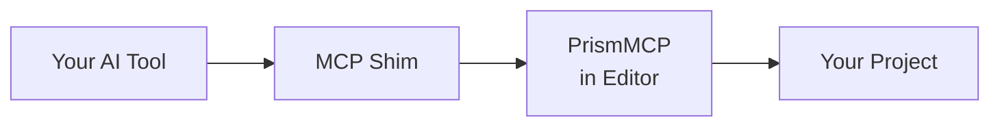

<!--
  PrismMCP marketing surface README.
  Source content authored in T1.33 brainstorm 2026-05-09 + amended 2026-05-10 post-bifurcation.
  Spec of truth: github.com/Asara-Technologies/prism-mcp-source
                 docs/superpowers/specs/2026-05-10-prismmcp-marketing-surfaces-design.md
-->

> [!IMPORTANT]
> **Coming Soon.** Pre-launch preview. Pricing, links, and copy may change before public launch. Feedback from testers and reviewers welcome.

<div align="center">

<sub><strong>ASARA PRISMMCP</strong></sub>

# Direct AI access to Unreal Engine.<br/>A professional force multiplier.

**Plumbing handled. Ship more game.**


[**Get Professional**][buy] &nbsp;·&nbsp; [Try on Fab][fab] &nbsp;·&nbsp; [Watch Demo][demo]

[buy]: #pricing
[fab]: #
[demo]: #
[fab-product]: #
[direct-product]: #

</div>

---

## Engineers move faster. Everyone else stops waiting.<br/>*That's PrismMCP.*

Twenty years building games, from large studios to solo projects, from early
incubation to live ops. I know what we do day to day, and I built PrismMCP
with that in mind. How quickly we can understand a feature, debug an issue,
test, make a build, and get back to work matters as much as our ability to
make content. Maybe more. PrismMCP has both sides covered.

Engineer, designer, artist, producer. Whatever your role, PrismMCP bridges
the engineering gap that usually slows everyone else down.

I use PrismMCP personally and iterate on it daily, the same way we all
iterate on our games. If there's a workflow it doesn't cover, a bug, or a
plugin you need supported, let me know. I'll stand it up quickly, or get
back to you with a timeline. My whole career has been building
force-multiplying workflows. I'm truly excited to help with yours.

**Roger**, Asara Technologies

---

## PrismMCP ships in two SKUs

**Lite: gameplay authoring.** Level actors, Blueprints (full authoring surface), Blueprint live debugging, components, Blackboard authoring, content browser, selection, console, PIE. The surface you live in day to day. [Sold on Fab][fab-product].

**Professional: the full editor.** Everything in Lite plus the production toolchain: Materials, UMG, Animation & Rigging, Cinematics, Audio, Build & Ship, Profiling, Automation tests, Data, World Partition, Source Control, native type reflection, editor lifecycle, Live Coding. [Sold direct from Asara][direct-product].

Full split below.

> [!NOTE]
> **Full undo and redo on every write.** Every PrismMCP command participates in UE's transaction system. Hit Ctrl+Z to back out a change, or have your AI agent call `undo` and read `get_undo_history` programmatically to roll back cleanly. Inline graph-wiring failures roll back automatically before they corrupt the graph.

### Capability matrix

| Capability | Coverage | Lite | Professional |
|:---|:---|:---:|:---:|
| **Level actors** | Spawn, transform, delete; outliner; tags | ✓ | ✓ |
| **Blueprint scaffolding** | Class, variables, CDO defaults, function calls | ✓ | ✓ |
| **Blueprint graph editing** | 72 node types, transactional rollback | ✓ | ✓ |
| **Blueprint live debugging** | Breakpoints, stepping, watches, call stack snapshots | ✓ | ✓ |
| **Components / SCS** | Authoring on actors and Blueprints | ✓ | ✓ |
| **Selection state** | Get and set; by class or tag | ✓ | ✓ |
| **Content Browser** | Folders, asset organization, moves | ✓ | ✓ |
| **Console + CVars** | Read state, set CVars | ✓ | ✓ |
| **Output Log + Message Log** | Read with severity filter | ✓ | ✓ |
| **Usage stats** | Aggregate per-session call bytes and estimated tokens | ✓ | ✓ |
| **PIE** | Start, stop | ✓ | ✓ |
| **Blackboard authoring** | Assets, parent chains, 12 native key types, reverse users | ✓ | ✓ |
| **Materials** | Instances, graph editing, layers, parameter collections | — | ✓ |
| **UMG** | Widget tree, bindings, animations, Editor Utility Widgets | — | ✓ |
| **Animation & Rigging** | AnimBP, montages, Control Rig, IK Rig, IK Retargeter | — | ✓ |
| **Cinematics** | LevelSequence, keyframes, MRQ rendering | — | ✓ |
| **Audio** | Audio assets, Sound Cue discovery/readback/node CRUD/edge wiring/auto-layout/property writes, MetaSound interface I/O, Sound Class/Mix, Submix routing, Source/Audio Bus sends | — | ✓ |
| **Build & Ship** | Cook, package, archive, deploy, launch | — | ✓ |
| **Profiling** | Frame stats, Trace, Insights | — | ✓ |
| **Automation tests** | Discover, run async, poll progress and results | — | ✓ |
| **Enhanced Input + Game Features** | Input Actions, Mapping Contexts, modifiers, triggers; plugin lifecycle | — | ✓ |
| **Gameplay Tags** | Hierarchy, project CRUD, container matching, queries | — | ✓ |
| **Gameplay Ability System** | Via Blueprint surface (deeper authoring planned) | — | ✓ |
| **Data** | DataTables, DataAssets, Type System | — | ✓ |
| **World Partition** | OFPA, DataLayers, streaming, level composition | — | ✓ |
| **Source Control** | Provider status, read commands, write commands | — | ✓ |
| **Native type reflection** | K2Node discriminators; Asset Registry queries | — | ✓ |
| **Editor lifecycle** | save_all, shutdown, project metadata | — | ✓ |
| **Live Coding** | Compile trigger, structured error capture | — | ✓ |

### Surface in detail

<details>
<summary><strong>Blueprints: full surface</strong></summary>

| Capability | Coverage | Lite | Professional |
|:---|:---|:---:|:---:|
| **Class authoring** | Create class, set CDO defaults, compile | ✓ | ✓ |
| **Variables** | Full UPROPERTY flag and metadata control | ✓ | ✓ |
| **Function calls on placed actors** | Call existing functions on placed BP actors | ✓ | ✓ |
| **Components** | Add, remove, reparent, transforms, attachment | ✓ | ✓ |
| **Graph reading** | 4 detail levels for token-cost control | ✓ | ✓ |
| **Graph authoring** | 72 node types, inline wiring, transactional rollback | ✓ | ✓ |
| **Graph tooling** | Auto-layout, comments, reroute knots, stale-reference scan | ✓ | ✓ |
| **Function authoring** | Signatures, params, returns, pure/const flags | ✓ | ✓ |
| **Dispatchers, delegates, interfaces** | With stub graph generation | ✓ | ✓ |
| **Live debugging** | Breakpoints, step controls, watches, pin eval, debug targets | ✓ | ✓ |

</details>

<details>
<summary><strong>Levels and World: full surface</strong></summary>

| Capability | Coverage | Lite | Professional |
|:---|:---|:---:|:---:|
| **Actor lifecycle** | Spawn, move, delete; transforms; tags | ✓ | ✓ |
| **Outliner** | Queries, folder CRUD, selection state | ✓ | ✓ |
| **Instance editing** | Variable editing, attach/detach, instance components | ✓ | ✓ |
| **Sub-levels** | Basic sub-level loads | ✓ | ✓ |
| **World Partition** | Actor load, pin, dirty-actor protection | — | ✓ |
| **DataLayers** | List, read/write membership, runtime state | — | ✓ |
| **Level composition** | Sub-levels, streaming, level instances at scale | — | ✓ |
| **Batch operations** | Multi-op transactions | — | ✓ |

</details>

<details>
<summary><strong>Editor surface: Lite and Professional</strong></summary>

| Capability | Coverage | Lite | Professional |
|:---|:---|:---:|:---:|
| **Console + CVars** | Read state, set CVars | ✓ | ✓ |
| **Output Log + Message Log** | Read with severity filter | ✓ | ✓ |
| **Usage stats** | Aggregate per-session call bytes and estimated tokens | ✓ | ✓ |
| **Selection state** | Get/set selected actors; select by class or tag | ✓ | ✓ |
| **Content Browser** | Folders, asset organization, moves with proper UE references | ✓ | ✓ |
| **PIE** | Start, stop | ✓ | ✓ |
| **Editor lifecycle** | save_all, shutdown_editor, project metadata | — | ✓ |
| **Live Coding control** | Compile trigger, structured error capture | — | ✓ |
| **Undo / redo** | Structured history queries | — | ✓ |

</details>

<details>
<summary><strong>Materials: Professional only</strong></summary>

*Not included in Lite. Available in Professional.*

| Capability | Coverage | Professional |
|:---|:---|:---:|
| **Material assets** | Create, recompile, auto-layout expressions | ✓ |
| **Expression graph** | Read at 3 detail levels; search by type, parameter, or value | ✓ |
| **Expression authoring** | Registered discriminators plus `Custom` escape hatch | ✓ |
| **Parameter authoring** | Scalar, vector, texture, static switch | ✓ |
| **Material instances (MIC)** | Create, reparent, override walk | ✓ |
| **Static switches** | Set, list | ✓ |
| **Material layers** | Assign layer functions and blends; full layer-stack read | ✓ |
| **Material parameter collections (MPC)** | Create, scalar/vector authoring with type inference, info readback | ✓ |

</details>

<details>
<summary><strong>UMG: Professional only</strong></summary>

*Not included in Lite. Available in Professional.*

| Capability | Coverage | Professional |
|:---|:---|:---:|
| **Widget discovery** | List loaded UWidget classes; class inspection | ✓ |
| **Widget tree authoring** | Build or replace from recursive JSON hierarchy | ✓ |
| **Property bindings** | UMG native editor binding table CRUD | ✓ |
| **Event bindings** | Bind widget multicast delegates | ✓ |
| **Widget animations** | Track add, keyframe edit, animation modify and list | ✓ |
| **Editor Utility Widgets (EUW) and Blueprints (EUB)** | Create, spawn as tab, run | ✓ |

</details>

<details>
<summary><strong>Animation and Rigging: Professional only</strong></summary>

*Not included in Lite. Available in Professional.*

| Capability | Coverage | Professional |
|:---|:---|:---:|
| **AnimGraph authoring** | Via Blueprint stack: slot, blend, additive, state machine | ✓ |
| **Animation Montages** | Section CRUD, notify add/remove, float-curve key edits | ✓ |
| **Skeleton and SkeletalMesh inspection** | Bones, sockets, curves, morph targets | ✓ |
| **Control Rig** | Blueprint create, RigVM graph read/write, hierarchy edits, VM compile | ✓ |
| **IK Rig** | Solver stack (Limb, FullBodyIK, BodyMover, Pole, SetTransform, StretchLimb); goals; retarget chains | ✓ |
| **IK Retargeter** | Asset CRUD, rig binding, chain mapping, auto-map, pose edits | ✓ |

</details>

<details>
<summary><strong>Cinematics: Professional only</strong></summary>

*Not included in Lite. Available in Professional.*

| Capability | Coverage | Professional |
|:---|:---|:---:|
| **LevelSequence lifecycle** | Create, open in editor, get metadata | ✓ |
| **Bindings** | List, add/remove possessable, set display names | ✓ |
| **Tracks and sections** | Typed tracks, section frame ranges, event endpoints | ✓ |
| **Keyframes** | Get/set values, per-key interpolation, tangent handles, batch add | ✓ |
| **Composition** | Subsequence list/walk, camera-cut shots, shot camera binding | ✓ |
| **Playback and rendering** | Playback control; MoviePipeline render queue and status | ✓ |

</details>

<details>
<summary><strong>Audio: Professional only</strong></summary>

*Not included in Lite. Available in Professional.*

| Capability | Coverage | Professional |
|:---|:---|:---:|
| **Audio asset lifecycle** | Create and inspect Sound Cue, MetaSound Source/Patch, Sound Class, Sound Mix, Attenuation, Concurrency, Submix, Audio Bus, and Source Bus assets | ✓ |
| **Sound Cue graph authoring** | Discover Sound Node types, read Sound Cue runtime trees plus editor layout metadata, add/remove/move graph nodes, wire/unwire node edges, auto-layout graphs, and write node properties | ✓ |
| **MetaSound interface** | Read Source/Patch interfaces and graphs; add/remove root inputs and Patch outputs with primitive defaults | ✓ |
| **Sound Class / Mix** | Hierarchy, class adjustments, and PIE-gated mix modifiers | ✓ |
| **Submix and bus routing** | Submix hierarchy, submix/source effect chains, Audio Bus sends, Source Bus sends, and SourceBus cycle rejection | ✓ |

</details>

<details>
<summary><strong>Build and Ship: Professional only</strong></summary>

*Not included in Lite. Available in Professional.*

| Capability | Coverage | Professional |
|:---|:---|:---:|
| **Build discovery** | Platforms, devices, build targets, project build metadata | ✓ |
| **Build sessions** | Shared session manager, progress, current step, log tail | ✓ |
| **Map builds** | Geometry, lighting, navigation, HLODs, texture and virtual texture streaming | ✓ |
| **Cook, package, archive** | RunUAT BuildCookRun sessions | ✓ |
| **Deploy and launch** | To discovered target devices; launch-after-deploy | ✓ |

</details>

<details>
<summary><strong>Profiling and Automation: Professional only</strong></summary>

*Not included in Lite. Available in Professional.*

| Capability | Coverage | Professional |
|:---|:---|:---:|
| **Frame stats** | Captures and queries | ✓ |
| **Trace sessions** | Start, stop, channel control | ✓ |
| **Insights integration** | Read trace data; query event streams | ✓ |
| **Automation tests** | List tests, start async session, poll progress and results | ✓ |

</details>

<details>
<summary><strong>Input and Gameplay: Professional only</strong></summary>

*Not included in Lite. Available in Professional.*

| Capability | Coverage | Professional |
|:---|:---|:---:|
| **Enhanced Input** | Input Actions, Input Mapping Contexts, modifier and trigger config | ✓ |
| **Gameplay Tags** | Tag editing, ini-table CRUD, hierarchy management | ✓ |
| **Game Features / Modular Gameplay** | Plugin lifecycle, feature state | ✓ |

</details>

<details>
<summary><strong>Data: Professional only</strong></summary>

*Not included in Lite. Available in Professional.*

| Capability | Coverage | Professional |
|:---|:---|:---:|
| **DataTable** | Row CRUD, struct schema lookup, batch updates | ✓ |
| **DataAsset** | CRUD, property edit, subclass listing | ✓ |
| **Type System** | UDS / User Defined Enum / Struct create, modify, get | ✓ |
| **Generic asset creation** | Factory-backed `create_asset` | ✓ |

</details>

<details>
<summary><strong>Source Control: Professional only</strong></summary>

*Not included in Lite. Available in Professional.*

| Capability | Coverage | Professional |
|:---|:---|:---:|
| **Provider status** | Connected provider; branch and workspace info | ✓ |
| **Read commands** | File state, write-readiness, prepare-for-edit | ✓ |
| **Write commands** | Checkout, revert, submit (narrow, transaction-safe) | ✓ |

</details>

<details>
<summary><strong>Authoring discovery: Professional only</strong></summary>

*Not included in Lite. Available in Professional.*

| Capability | Coverage | Professional |
|:---|:---|:---:|
| **Native type reflection** | Search C++ classes, structs, enums; inspect UClass, UScriptStruct, UEnum | ✓ |
| **K2Node discriminators** | Discoverable K2Node types for graph authoring | ✓ |
| **Asset Registry queries** | Asset search, metadata, package dependencies, reverse references | ✓ |

</details>

---

## On the roadmap

The matrix above is today's shipped surface. Here's what's planned next. Order, scope, and timing are not committed; items move based on customer demand, engine changes, and effort.

**Authoring expansions**

- **Behavior Trees / EQS.** Tree authoring and EQS option/test editing. Blackboard schema authoring is now shipped in Lite and Professional.
- **StateTree.** State hierarchy, evaluators, tasks, conditions, transitions.
- **Smart Objects.** Definitions, slots, activity tags, world placement, and StateTree interaction hooks.
- **Niagara.** System and emitter lifecycle, parameter access, limited graph mutation.
- **Audio depth.** Remaining MetaSound default edits, parent-interface mutation, compile diagnostics, and preview/runtime controls. Audio asset lifecycle, Sound Cue node discovery/readback/CRUD/edge wiring/auto-layout/property writes, MetaSound interface/graph inspection plus root input/output CRUD, SoundClass/SoundMix authoring, and Submix/Bus routing are now shipped in Professional.
- **Gameplay Ability System depth.** Dedicated attribute, derivation, and execution-calc tooling beyond today's Blueprint surface.

**Workflow expansions**

- **Editor tab and dock layout.** Sense and manipulate layout; save and restore named workspaces.
- **Cross-system debugger coverage.** Control Rig, StateTree, and Behavior Tree runtime/debug surfaces after the shared debugging contract lands.
- **Source Control expansion.** Submit, branch, sync, merge orchestration on top of today's read and checkout surface.
- **Cross-platform builds.** Mac and Linux build axis.

<sub>*Professional gets the full roadmap. Lite also receives gameplay-authoring core expansions where they fit that SKU, including Behavior Tree, StateTree, Smart Objects, and the shipped Blueprint debugging surface.*</sub>

---

## Built on the Model Context Protocol

Your AI tool connects to a running Unreal Editor through a small MCP shim. Commands flow as typed JSON-RPC calls; the editor responds with structured results.



Works with **Claude Code**, **Cursor**, **Claude Desktop**, and any MCP-compatible agent.

---

## Pricing

### Direct from Asara: annual license, no auto-renewal

| | Professional — Personal | Professional — Developer | Studio |
|:---|:---:|:---:|:---:|
| **Price** | **$99** per user / year | **$199** per user / year<br/><sub>5+ users $149 · 25+ $99 · 50+ Contact</sub> | **Contact** |
| **Eligibility** | Under $100K USD revenue | $100K+ USD revenue | Custom |
| **Coverage** | Full Pro surface | Full Pro surface | Pro plus full source |
| **Machine activations per user** | 2 | 5 | Custom |
| **Term** | 12 months, no auto-renewal | 12 months, no auto-renewal | Custom |
| **Support** | Direct email, priority triage | Direct email, priority triage | Dedicated time, private channel, custom feature work |
| **License** | Custom Asara EULA | Custom Asara EULA | Custom Asara EULA plus Source License Addendum |

<div align="center">

[**Get Professional**][direct-product] &nbsp;·&nbsp; [Read the EULA][eula]

[eula]: #

</div>

### On Fab: one-time purchase

| | Lite — Personal | Lite — Developer |
|:---|:---:|:---:|
| **Price** | **$20** per user | **$69** per user |
| **Eligibility** | Under $100K USD revenue · Individual students and personal learning | $100K+ USD revenue |
| **Coverage** | Gameplay-authoring core | Same scope as Personal |
| **Term** | One-time, version-frozen | One-time, version-frozen |
| **Support** | Fab community + public Asara issues | Fab community + public Asara issues |
| **License** | Fab Standard License (Epic) | Fab Standard License (Epic) |

<div align="center">

[**Try on Fab**][fab-product]

</div>

> [!NOTE]
> **Direct licenses are annual, no auto-renewal.** Your license is valid for 12 months from activation. You always get the latest version while your license is active. To keep using PrismMCP after the term ends, buy a new license. A short offline grace window covers the gap so a forgotten or in-flight purchase doesn't lock you out the moment the term flips. We send one reminder email 30 days before the term ends. *Lite (Fab) purchases are one-time and version-frozen, with no expiration.*

### Pricing FAQ

<details>
<summary><strong>What's the difference between Lite and Professional?</strong></summary>

Lite (Fab) covers the gameplay-authoring core: actors, Blueprints (including graph editing and live debugging), components, Blackboard authoring, basic editor surface, content browser. Professional (Direct) adds the production toolchain: Materials, UMG, Animation, Cinematics, Audio, Build & Ship, Profiling, Automation, Data, Source Control, and the rest. Roughly 100+ commands vs the full ~450.

</details>

<details>
<summary><strong>Why is Direct annual instead of one-time like Fab?</strong></summary>

Direct customers get continuous updates, priority support, and DRM that ties licenses to your machines so we can keep the tool secure and aligned with our roadmap. The annual model reflects what you're actually getting: a working tool, not a snapshot. No auto-renewal. When the 12 months end, buy again if you want another year. We send a single reminder email 30 days before the term ends so you can decide on your own schedule.

</details>

<details>
<summary><strong>Can I move my license to a new machine? <em>(Direct only)</em></strong></summary>

Each license has a fixed number of machine activations per user (Professional — Personal: 2, Professional — Developer: 5). Deactivating one machine frees a slot. Lost laptop, dead drive, hardware swap: email me and I'll release the activation manually.

</details>

<details>
<summary><strong>What's the refund policy?</strong></summary>

Lite (Fab): per Fab's site policy. Direct (Professional — Personal, Professional — Developer including bulk, and Studio): 30-day no-questions refund from first activation, 60-day hard cap from purchase. Studio refunds are also case-by-case at Asara's discretion if the contract is silent. We want you happy.

</details>

<details>
<summary><strong>Do I need an internet connection? <em>(Direct only)</em></strong></summary>

PrismMCP works offline. Your license re-verifies in the background per the activation policy; if the license server is unreachable for an extended period, the tool keeps working through a grace window before requiring re-verification. Long-term airgapped deployments are a Studio tier conversation.

</details>

<details>
<summary><strong>What if my revenue grows past $100K mid-year?</strong></summary>

Eligibility is checked at each purchase, same convention as Fab. If you cross $100K during your 12-month term, finish out the term on Personal; the next time you buy, move to Developer. We don't audit. Buyer attestation is the contract.

</details>

<sub>*These are plain-English summaries. Full legal terms in the [EULA][eula].*</sub>

---

## Get started

Up and running in under 5 minutes.

**▸ Lite (Fab)**

1. Install PrismMCP Lite from [Fab][fab] (Personal $20 or Developer $69)
2. Connect your MCP client (Claude Code, Cursor, Claude Desktop, etc.)
3. Issue your first command

**▸ Professional (Direct)**

1. [Buy a Professional license][buy] ($99/year Personal · $199/year Developer · Studio Contact)
2. Activate your license key (one-click on first launch)
3. Connect your MCP client
4. Issue your first command

**Compatibility:** UE 5.3 · 5.4 · 5.5 · 5.6 · 5.7 · Win · Mac · Linux

```json
{
  "mcpServers": {
    "unreal": {
      "command": "path/to/PrismMCP-Shim",
      "args": ["--port", "55557"]
    }
  }
}
```

API reference ships inside the plugin install. Setup guides and workflow recipes will be published in this repo at launch.

---

## Support

| Tier | What you get |
|:---|:---|
| **Lite — Personal · Lite — Developer** *(Fab)* | Fab community + public Asara GitHub issues |
| **Professional — Personal · Professional — Developer** *(Direct)* | Public issue triage + **direct email** + priority response |
| **Studio** *(Direct)* | Dedicated time, private channel, custom feature work |

Public issues: [github.com/Asara-Technologies/prism-mcp/issues][issues]<br/>
Professional & Studio contact: [support@asaratechnologies.com][support]

[issues]: https://github.com/Asara-Technologies/prism-mcp/issues
[support]: mailto:support@asaratechnologies.com

---

## About Asara

Asara is a California game-tools company, founded in 2026. We build
force-multiplying tools for game developers, starting with PrismMCP:
direct AI access to the Unreal Engine editor.

<sub>*Asara Technologies LLC.*</sub>

---

## Legal

**▸ Direct buyers** *(Professional, Studio)*

- [Asara End User License Agreement][eula]
- [Privacy Policy][privacy]
- [Refund Policy][refunds]

**▸ Fab buyers** *(Lite — Personal, Lite — Developer)*

- [Fab Standard License][fab-eula] *(governed by Epic)*
- [Privacy Policy][privacy] *(Asara)*
- Refunds via [Fab's site policy][fab-refunds]

[privacy]: #
[refunds]: REFUNDS.md
[fab-eula]: https://www.fab.com/eula
[fab-refunds]: https://fab.com/help/refund-policy

---

<div align="center">
<sub>

PrismMCP™ is a trademark of Asara Technologies LLC. Unreal Engine® is a
trademark of Epic Games, Inc.

© 2026 Asara Technologies LLC. All rights reserved.

</sub>
</div>
