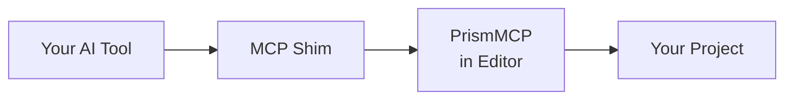

<!--
  PrismMCP marketing surface README.
  Source content authored in T1.33 brainstorm 2026-05-09 + amended 2026-05-10 post-bifurcation.
  Spec of truth: github.com/Asara-Technologies/prism-mcp-source
                 docs/superpowers/specs/2026-05-10-prismmcp-marketing-surfaces-design.md
-->

> [!IMPORTANT]
> **Coming Soon.** Pre-launch preview. Pricing, links, and copy may change before public launch. Feedback from testers and reviewers welcome.

<div align="center">

<sub><strong>ASARA PRISMMCP</strong></sub>

# Direct AI access to Unreal Engine.<br/>A professional force multiplier.

**Plumbing handled. Ship more game.**


[**Get Professional**][buy] &nbsp;·&nbsp; [Try on Fab][fab] &nbsp;·&nbsp; [Watch Demo][demo]

[buy]: #pricing
[fab]: #
[demo]: #
[fab-product]: #
[direct-product]: #

</div>

---

## Engineers move faster. Everyone else stops waiting.<br/>*That's PrismMCP.*

Twenty years building games, from large studios to solo projects, from early
incubation to live ops. I know what we do day to day, and I built PrismMCP
with that in mind. How quickly we can understand a feature, debug an issue,
test, make a build, and get back to work matters as much as our ability to
make content. Maybe more. PrismMCP has both sides covered.

Engineer, designer, artist, producer. Whatever your role, PrismMCP bridges
the engineering gap that usually slows everyone else down.

I use PrismMCP personally and iterate on it daily, the same way we all
iterate on our games. If there's a workflow it doesn't cover, a bug, or a
plugin you need supported, let me know. I'll stand it up quickly, or get
back to you with a timeline. My whole career has been building
force-multiplying workflows. I'm truly excited to help with yours.

**Roger**, Asara Technologies

---

## PrismMCP ships in two SKUs

**Lite — gameplay authoring.** Level actors, Blueprints (full authoring surface), components, content browser, selection, console, PIE. The surface you live in day to day. [Sold on Fab][fab-product].

**Professional — the full editor.** Everything in Lite plus the production toolchain: Materials, UMG, Animation & Rigging, Cinematics, Build & Ship, Profiling, Automation tests, Data, World Partition, Source Control, native type reflection, editor lifecycle, Live Coding. [Sold direct from Asara][direct-product].

Full split below.

> [!NOTE]
> **Full undo and redo on every write.** Every PrismMCP command participates in UE's transaction system. Hit Ctrl+Z to back out a change, or have your AI agent call `undo` and read `get_undo_history` programmatically to roll back cleanly. Inline graph-wiring failures roll back automatically before they corrupt the graph.

### Capability matrix

| | Lite | Professional |
|:---|:---:|:---:|
| Level actors — spawn/transform/delete, outliner, tags | ✓ | ✓ |
| Blueprint scaffolding — class, variables, CDO defaults, function calls | ✓ | ✓ |
| **Blueprint graph editing** — 72 node types, transactional rollback | ✓ | ✓ |
| Components / SCS authoring on actors and BPs | ✓ | ✓ |
| Selection state — get/set, by class/tag | ✓ | ✓ |
| Content Browser — folders, asset organization, moves | ✓ | ✓ |
| Console + CVars | ✓ | ✓ |
| Output Log + Message Log read | ✓ | ✓ |
| PIE start/stop | ✓ | ✓ |
| **Materials** — instances + graph editing + layers + parameter collections | — | ✓ |
| **UMG** — widget tree authoring + bindings + animations + Editor Utility Widgets | — | ✓ |
| **Animation & Rigging** — AnimBP, montages, Control Rig, IK Rig, IK Retargeter | — | ✓ |
| **Cinematics** — LevelSequence, keyframes, MRQ rendering | — | ✓ |
| **Build & Ship** — cook, package, archive, deploy, launch | — | ✓ |
| **Profiling** — frame stats, Trace, Insights | — | ✓ |
| **Automation tests** | — | ✓ |
| **Enhanced Input** authoring · Game Features | — | ✓ |
| **Gameplay Tags** — hierarchy, project CRUD, container matching, queries | — | ✓ |
| **Gameplay Ability System** *(via Blueprint surface; deeper authoring planned)* | — | ✓ |
| **Data** — DataTables, DataAssets, Type System | — | ✓ |
| **World Partition** · OFPA · DataLayers · streaming · level composition | — | ✓ |
| **Source Control** — provider status, read commands, write commands | — | ✓ |
| **Native type reflection** · K2Node discriminators · Asset Registry | — | ✓ |
| **Editor lifecycle** — save_all, shutdown, project metadata | — | ✓ |
| **Live Coding control** | — | ✓ |

### Surface in detail

<details>
<summary><strong>Blueprints — full surface</strong></summary>

| Surface | Lite | Professional |
|---|:---:|:---:|
| Class authoring — create class, set CDO defaults, compile | ✓ | ✓ |
| Variables — full UPROPERTY flag and metadata control | ✓ | ✓ |
| Call existing functions on placed BP actors | ✓ | ✓ |
| Components — add, remove, reparent, transforms, attachment | ✓ | ✓ |
| Graph reading — 4 detail levels for token-cost control | ✓ | ✓ |
| Graph authoring — 72 node types, inline wiring, transactional rollback | ✓ | ✓ |
| Auto-layout, comments, reroute knots, stale-reference scan | ✓ | ✓ |
| Function authoring (signatures, params, returns, pure/const flags) | ✓ | ✓ |
| Dispatchers, delegates, interfaces with stub graph generation | ✓ | ✓ |

</details>

<details>
<summary><strong>Levels & World — full surface</strong></summary>

| Surface | Lite | Professional |
|---|:---:|:---:|
| Spawn / move / delete actors, transforms, tags | ✓ | ✓ |
| Outliner queries, folder CRUD, selection state | ✓ | ✓ |
| Instance variable editing, attach/detach, instance components | ✓ | ✓ |
| Basic sub-level loads | ✓ | ✓ |
| **World Partition** — actor load, pin, dirty-actor protection | — | ✓ |
| **DataLayers** — list, read/write membership, runtime state | — | ✓ |
| Level composition — sub-levels, streaming, level instances at scale | — | ✓ |
| Batch operation execution — multi-op transactions | — | ✓ |

</details>

<details>
<summary><strong>Editor Surface — Lite + Professional</strong></summary>

| Surface | Lite | Professional |
|---|:---:|:---:|
| Console + CVars — read state, set CVars | ✓ | ✓ |
| Output Log + Message Log read | ✓ | ✓ |
| Selection state — get/set selected actors, select by class/tag | ✓ | ✓ |
| Content Browser — folders, asset organization, moves with proper UE references | ✓ | ✓ |
| PIE start/stop | ✓ | ✓ |
| **Editor lifecycle** — save_all, shutdown_editor, project metadata | — | ✓ |
| **Live Coding control** | — | ✓ |
| **Undo / redo** with structured history queries | — | ✓ |

</details>

<details>
<summary><strong>Materials — Professional only</strong></summary>

*Not included in Lite. Available in Professional.*

| Surface | Professional |
|---|:---:|
| Material assets — create, recompile, auto-layout expressions | ✓ |
| Expression graph — read (3 detail levels), search by type/parameter/value | ✓ |
| Expression authoring — registered discriminators + `Custom` escape hatch | ✓ |
| Parameter authoring — scalar, vector, texture, static switch | ✓ |
| Material instances (MIC) — create, reparent, override walk | ✓ |
| Static switches — set + list | ✓ |
| Material layers — assign layer functions + blends, full layer-stack read | ✓ |

</details>

<details>
<summary><strong>UMG — Professional only</strong></summary>

*Not included in Lite. Available in Professional.*

| Surface | Professional |
|---|:---:|
| Widget discovery — list loaded UWidget classes, class inspection | ✓ |
| Widget tree authoring — build/replace from recursive JSON hierarchy | ✓ |
| Property bindings — UMG native editor binding table CRUD | ✓ |
| Event bindings — bind widget multicast delegates | ✓ |
| Widget animations — track add, keyframe edit, animation modify/list | ✓ |
| Editor Utility Widgets (EUW) and Blueprints (EUB) — create, spawn as tab, run | ✓ |

</details>

<details>
<summary><strong>Animation & Rigging — Professional only</strong></summary>

*Not included in Lite. Available in Professional.*

| Surface | Professional |
|---|:---:|
| AnimGraph authoring via Blueprint stack — slot, blend, additive, state machine | ✓ |
| Animation Montages — section CRUD, notify add/remove, float-curve key edits | ✓ |
| Skeleton & SkeletalMesh inspection — bones, sockets, curves, morph targets | ✓ |
| Control Rig — Blueprint create, RigVM graph read/write, hierarchy edits, VM compile | ✓ |
| IK Rig — solver stack (Limb, FullBodyIK, BodyMover, Pole, SetTransform, StretchLimb), goals, retarget chains | ✓ |
| IK Retargeter — asset CRUD, rig binding, chain mapping, auto-map, pose edits | ✓ |

</details>

<details>
<summary><strong>Cinematics — Professional only</strong></summary>

*Not included in Lite. Available in Professional.*

| Surface | Professional |
|---|:---:|
| LevelSequence lifecycle — create, open in editor, get metadata | ✓ |
| Bindings — list, add/remove possessable, set display names | ✓ |
| Tracks & sections — typed tracks, section frame ranges, event endpoints | ✓ |
| Keyframes — get/set values, per-key interpolation, tangent handles, batch add | ✓ |
| Composition — subsequence list/walk, camera-cut shots, shot camera binding | ✓ |
| Playback & rendering — playback control, MoviePipeline render queue + status | ✓ |

</details>

<details>
<summary><strong>Build & Ship — Professional only</strong></summary>

*Not included in Lite. Available in Professional.*

| Surface | Professional |
|---|:---:|
| Build discovery — platforms, devices, build targets, project build metadata | ✓ |
| Build sessions — shared session manager, progress, current step, log tail | ✓ |
| Map builds — geometry, lighting, navigation, HLODs, texture/virtual texture streaming | ✓ |
| Cook, package, archive — RunUAT BuildCookRun sessions | ✓ |
| Deploy & launch — to discovered target devices, launch-after-deploy | ✓ |

</details>

<details>
<summary><strong>Profiling & Automation — Professional only</strong></summary>

*Not included in Lite. Available in Professional.*

| Surface | Professional |
|---|:---:|
| Frame stats — captures and queries | ✓ |
| Trace sessions — start, stop, channel control | ✓ |
| Insights integration — read trace data, query event streams | ✓ |
| Automation tests — list tests, start async session, poll progress + results | ✓ |

</details>

<details>
<summary><strong>Input & Gameplay — Professional only</strong></summary>

*Not included in Lite. Available in Professional.*

| Surface | Professional |
|---|:---:|
| Enhanced Input — Input Actions, Input Mapping Contexts, modifier/trigger config | ✓ |
| Gameplay Tags — tag editing, ini-table CRUD, hierarchy management | ✓ |
| Game Features / Modular Gameplay — plugin lifecycle, feature state | ✓ |

</details>

<details>
<summary><strong>Data — Professional only</strong></summary>

*Not included in Lite. Available in Professional.*

| Surface | Professional |
|---|:---:|
| DataTable — row CRUD, struct schema lookup, batch updates | ✓ |
| DataAsset — CRUD, property edit, subclass listing | ✓ |
| Type System — UDS / User Defined Enum / Struct create + modify + get | ✓ |
| Generic asset creation — factory-backed `create_asset` | ✓ |

</details>

<details>
<summary><strong>Source Control — Professional only</strong></summary>

*Not included in Lite. Available in Professional.*

| Surface | Professional |
|---|:---:|
| Provider status — connected provider, branch/workspace info | ✓ |
| Read commands — file state, write-readiness, prepare-for-edit | ✓ |
| Write commands — checkout, revert, submit (narrow, transaction-safe) | ✓ |

</details>

<details>
<summary><strong>Authoring Discovery — Professional only</strong></summary>

*Not included in Lite. Available in Professional.*

| Surface | Professional |
|---|:---:|
| Native type reflection — search C++ classes/structs/enums, inspect UClass/UScriptStruct/UEnum | ✓ |
| K2Node discriminators — discoverable K2Node types for graph authoring | ✓ |
| Asset Registry queries — asset search, metadata, package dependencies, reverse refs | ✓ |

</details>

---

## On the roadmap

The matrix above is today's shipped surface. Here's what's planned next. Order, scope, and timing are not committed — items move based on customer demand, engine changes, and effort.

**Authoring expansions**

- **Behavior Trees / Blackboard / EQS** — tree authoring, BB schema, EQS option/test editing
- **StateTree** — state hierarchy, evaluators, tasks, conditions, transitions
- **Niagara** — system/emitter lifecycle, parameter access, limited graph mutation
- **Audio** — Sound Cue graph, SoundClass/SoundMix, MetaSound asset + graph
- **Material Parameter Collections** — global parameter broadcast
- **Gameplay Ability System depth** — dedicated attribute / derivation / execution-calc tooling beyond today's Blueprint surface

**Workflow expansions**

- **Editor tab & dock layout** — sense and manipulate layout, save/restore named workspaces
- **Source Control expansion** — submit, branch, sync, merge orchestration on top of today's read + checkout surface
- **Cross-platform builds** — Mac / Linux build axis

<sub>*All planned surface ships to Professional. Lite scope is locked at the gameplay-authoring core.*</sub>

---

## Built on the Model Context Protocol

Your AI tool connects to a running Unreal Editor through a small MCP shim. Commands flow as typed JSON-RPC calls; the editor responds with structured results.



Works with **Claude Code**, **Cursor**, **Claude Desktop**, and any MCP-compatible agent.

---

## Pricing

### Direct from Asara — annual lease

| | Professional — Personal | Professional — Developer | Studio |
|:---|:---:|:---:|:---:|
| **Price** | **$99** per user / year | **$199** per user / year<br/><sub>5+ users $149 · 25+ $99 · 50+ Contact</sub> | **Contact** |
| **Eligibility** | Under $100K USD revenue | $100K+ USD revenue | Negotiated |
| **Coverage** | Full Pro surface | Full Pro surface | Pro + full source |
| **Machine activations per user** | 2 | 5 | Negotiated |
| **Term** | Annual lease | Annual lease | Negotiated |
| **Support** | Direct email + priority triage | Direct email + priority triage | Dedicated time, private channel, custom feature work |
| **License** | Custom Asara EULA | Custom Asara EULA | Custom Asara EULA + Source License Addendum |

<div align="center">

[**Get Professional**][direct-product] &nbsp;·&nbsp; [Read the EULA][eula]

[eula]: #

</div>

### On Fab — one-time purchase

| | Lite — Personal | Lite — Developer |
|:---|:---:|:---:|
| **Price** | **$20** per user | **$69** per user |
| **Eligibility** | Under $100K USD revenue · Individual students and personal learning | $100K+ USD revenue |
| **Coverage** | Gameplay-authoring core | Same scope as Personal |
| **Term** | One-time, version-frozen | One-time, version-frozen |
| **Support** | Fab community + public Asara issues | Fab community + public Asara issues |
| **License** | Fab Standard License (Epic) | Fab Standard License (Epic) |

<div align="center">

[**Try on Fab**][fab-product]

</div>

> [!NOTE]
> **Direct licenses are annual.** Your license is valid for one year and renews at the same price. If you stop renewing, access ends after a short offline grace window. You always get the latest version while your license is active. *Lite (Fab) purchases are one-time and version-frozen — no renewal, no expiration.*

### Pricing FAQ

<details>
<summary><strong>What's the difference between Lite and Professional?</strong></summary>

Lite (Fab) covers the gameplay-authoring core — actors, Blueprints (including graph editing), components, basic editor surface, content browser. Professional (Direct) adds the production toolchain — Materials, UMG, Animation, Cinematics, Build & Ship, Profiling, Automation, Data, Source Control, the rest. Roughly 70 commands vs the full ~440.

</details>

<details>
<summary><strong>Why is Direct annual instead of one-time like Fab?</strong></summary>

Direct customers get continuous updates, priority support, and DRM that ties licenses to your machines so we can keep the tool secure and aligned with our roadmap. The annual lease reflects what you're actually getting — a working tool, not a snapshot.

</details>

<details>
<summary><strong>Can I move my license to a new machine? <em>(Direct only)</em></strong></summary>

Each license has a fixed number of machine activations per user (Professional — Personal: 2, Professional — Developer: 5). Deactivating one machine frees a slot. Lost laptop, dead drive, hardware swap — email me and I'll release the activation manually.

</details>

<details>
<summary><strong>What's the refund policy?</strong></summary>

Lite (Fab): per Fab's site policy. Direct (Professional — Personal, Professional — Developer including bulk, and Studio): 30-day no-questions refund from first activation, 60-day hard cap from purchase. Studio refunds are also case-by-case at Asara's discretion if the contract is silent. We want you happy.

</details>

<details>
<summary><strong>Do I need an internet connection? <em>(Direct only)</em></strong></summary>

PrismMCP works offline. Your license re-verifies in the background per the activation policy; if the license server is unreachable for an extended period, the tool keeps working through a grace window before requiring re-verification. Long-term airgapped deployments are a Studio tier conversation.

</details>

<details>
<summary><strong>What if my revenue grows past $100K mid-year?</strong></summary>

Eligibility is checked at purchase and renewal — same convention as Fab. If you cross $100K during your license term, finish out the term on Personal; at renewal, move to Developer. We don't audit. Buyer attestation is the contract.

</details>

<sub>*These are plain-English summaries. Full legal terms in the [EULA][eula].*</sub>

---

## Get started

Up and running in under 5 minutes.

**▸ Lite (Fab)**

1. Install PrismMCP Lite from [Fab][fab] (Personal $20 or Developer $69)
2. Connect your MCP client (Claude Code, Cursor, Claude Desktop, etc.)
3. Issue your first command

**▸ Professional (Direct)**

1. [Buy a Professional license][buy] ($99/year Personal · $199/year Developer · Studio Contact)
2. Activate your license key (one-click on first launch)
3. Connect your MCP client
4. Issue your first command

**Compatibility:** UE 5.3 · 5.4 · 5.5 · 5.6 · 5.7 · Win · Mac · Linux

```json
{
  "mcpServers": {
    "unreal": {
      "command": "path/to/PrismMCP-Shim",
      "args": ["--port", "55557"]
    }
  }
}
```

API reference ships inside the plugin install. Setup guides and workflow recipes will be published in this repo at launch.

---

## Support

| Tier | What you get |
|:---|:---|
| **Lite — Personal · Lite — Developer** *(Fab)* | Fab community + public Asara GitHub issues |
| **Professional — Personal · Professional — Developer** *(Direct)* | Public issue triage + **direct email** + priority response |
| **Studio** *(Direct)* | Dedicated time, private channel, custom feature work |

Public issues: [github.com/Asara-Technologies/prism-mcp/issues][issues]<br/>
Professional & Studio contact: [support@asaratechnologies.com][support]

[issues]: https://github.com/Asara-Technologies/prism-mcp/issues
[support]: mailto:support@asaratechnologies.com

---

## About Asara

Asara is a California game-tools company, founded in 2026. We build
force-multiplying tools for game developers, starting with PrismMCP:
direct AI access to the Unreal Engine editor.

<sub>*Asara Technologies LLC.*</sub>

---

## Legal

**▸ Direct buyers** *(Professional, Studio)*

- [Asara End User License Agreement][eula]
- [Privacy Policy][privacy]
- [Refund Policy][refunds]

**▸ Fab buyers** *(Lite — Personal, Lite — Developer)*

- [Fab Standard License][fab-eula] *(governed by Epic)*
- [Privacy Policy][privacy] *(Asara)*
- Refunds via [Fab's site policy][fab-refunds]

[privacy]: #
[refunds]: REFUNDS.md
[fab-eula]: https://www.fab.com/eula
[fab-refunds]: https://fab.com/help/refund-policy

---

<div align="center">
<sub>

PrismMCP™ is a trademark of Asara Technologies LLC. Unreal Engine® is a
trademark of Epic Games, Inc.

© 2026 Asara Technologies LLC. All rights reserved.

</sub>
</div>
